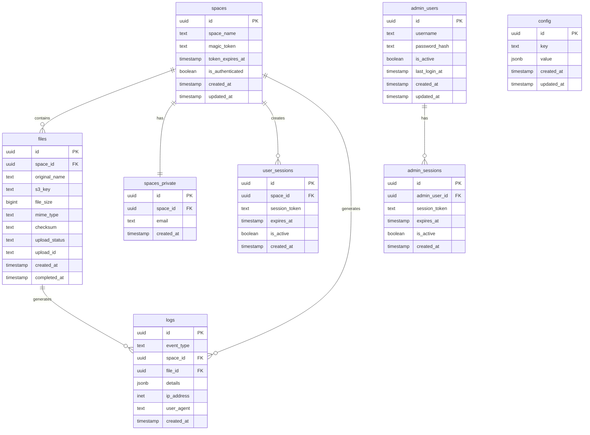

# Schéma de base de données - Drive Ooblik

## Vue d'ensemble

La base de données utilise PostgreSQL via Supabase avec Row Level Security (RLS) activé sur toutes les tables pour garantir la sécurité des données.

## Architecture



## Tables en détail

### 1. `spaces` - Espaces de transfert
Stocke les espaces de transfert créés par les utilisateurs.

| Colonne | Type | Description | Contraintes |
|---------|------|-------------|-------------|
| `id` | UUID | Identifiant unique | PK, DEFAULT gen_random_uuid() |
| `space_name` | TEXT | Nom de l'espace | NOT NULL |
| `magic_token` | TEXT | Token hashé (SHA-256) | UNIQUE, NULL après consommation |
| `token_expires_at` | TIMESTAMP | Expiration du magic token | NULL après consommation |
| `is_authenticated` | BOOLEAN | Statut d'authentification | DEFAULT false |
| `created_at` | TIMESTAMP | Date de création | NOT NULL, DEFAULT now() |
| `updated_at` | TIMESTAMP | Dernière modification | NOT NULL, DEFAULT now() |

**Index:**
- `idx_spaces_magic_token` sur `magic_token`
- `idx_spaces_space_name` sur `space_name`

### 2. `spaces_private` - Données privées des espaces
Sépare les données sensibles (emails) avec accès restreint.

| Colonne | Type | Description | Contraintes |
|---------|------|-------------|-------------|
| `id` | UUID | Identifiant unique | PK, DEFAULT gen_random_uuid() |
| `space_id` | UUID | Référence à l'espace | FK spaces(id), UNIQUE |
| `email` | TEXT | Email de l'utilisateur | NOT NULL |
| `created_at` | TIMESTAMP | Date de création | NOT NULL, DEFAULT now() |

### 3. `user_sessions` - Sessions utilisateur
Gère les sessions après authentification (durée: 4 heures).

| Colonne | Type | Description | Contraintes |
|---------|------|-------------|-------------|
| `id` | UUID | Identifiant unique | PK, DEFAULT gen_random_uuid() |
| `space_id` | UUID | Référence à l'espace | FK spaces(id), NOT NULL |
| `session_token` | TEXT | Token de session | NOT NULL, UNIQUE |
| `expires_at` | TIMESTAMP | Expiration de la session | NOT NULL |
| `is_active` | BOOLEAN | Session active | DEFAULT true |
| `created_at` | TIMESTAMP | Date de création | NOT NULL, DEFAULT now() |

**Index:**
- `idx_user_sessions_token` sur `session_token`
- `idx_user_sessions_expires` sur `expires_at`

### 4. `files` - Fichiers uploadés
Enregistre les métadonnées des fichiers.

| Colonne | Type | Description | Contraintes |
|---------|------|-------------|-------------|
| `id` | UUID | Identifiant unique | PK, DEFAULT gen_random_uuid() |
| `space_id` | UUID | Référence à l'espace | FK spaces(id) |
| `original_name` | TEXT | Nom original du fichier | NOT NULL |
| `s3_key` | TEXT | Clé S3 unique | NOT NULL, UNIQUE |
| `file_size` | BIGINT | Taille en octets | NOT NULL |
| `mime_type` | TEXT | Type MIME | NULL |
| `checksum` | TEXT | Hash du fichier | NULL |
| `upload_status` | TEXT | Statut de l'upload | CHECK IN ('pending', 'completed', 'failed') |
| `upload_id` | TEXT | ID multipart S3 | NULL |
| `created_at` | TIMESTAMP | Date de création | NOT NULL, DEFAULT now() |
| `completed_at` | TIMESTAMP | Date de complétion | NULL |

**Index:**
- `idx_files_space_id` sur `space_id`
- `idx_files_upload_status` sur `upload_status`

### 5. `logs` - Journal d'événements
Traçabilité complète des actions.

| Colonne | Type | Description | Contraintes |
|---------|------|-------------|-------------|
| `id` | UUID | Identifiant unique | PK, DEFAULT gen_random_uuid() |
| `event_type` | TEXT | Type d'événement | CHECK IN ('upload_init', 'part_uploaded', 'completed', 'delete', 'auth', 'error') |
| `space_id` | UUID | Référence à l'espace | FK spaces(id), NULL |
| `file_id` | UUID | Référence au fichier | FK files(id), NULL |
| `details` | JSONB | Détails supplémentaires | NULL |
| `ip_address` | INET | Adresse IP client | NULL |
| `user_agent` | TEXT | User agent | NULL |
| `created_at` | TIMESTAMP | Date de l'événement | NOT NULL, DEFAULT now() |

**Index:**
- `idx_logs_event_type` sur `event_type`
- `idx_logs_created_at` sur `created_at`
- `idx_logs_ip_address` sur `ip_address`

### 6. `admin_users` - Administrateurs
Comptes administrateurs de la plateforme.

| Colonne | Type | Description | Contraintes |
|---------|------|-------------|-------------|
| `id` | UUID | Identifiant unique | PK, DEFAULT gen_random_uuid() |
| `username` | TEXT | Nom d'utilisateur | NOT NULL, UNIQUE |
| `password_hash` | TEXT | Hash SHA-256 du mot de passe | NOT NULL |
| `email` | TEXT | Email admin | NULL |
| `is_active` | BOOLEAN | Compte actif | DEFAULT true |
| `last_login_at` | TIMESTAMP | Dernière connexion | NULL |
| `created_at` | TIMESTAMP | Date de création | NOT NULL, DEFAULT now() |
| `updated_at` | TIMESTAMP | Dernière modification | NOT NULL, DEFAULT now() |

### 7. `admin_sessions` - Sessions admin
Sessions des administrateurs (durée configurable).

| Colonne | Type | Description | Contraintes |
|---------|------|-------------|-------------|
| `id` | UUID | Identifiant unique | PK, DEFAULT gen_random_uuid() |
| `admin_user_id` | UUID | Référence à l'admin | FK admin_users(id) |
| `session_token` | TEXT | Token de session | NOT NULL, UNIQUE |
| `expires_at` | TIMESTAMP | Expiration | NOT NULL |
| `is_active` | BOOLEAN | Session active | DEFAULT true |
| `created_at` | TIMESTAMP | Date de création | NOT NULL, DEFAULT now() |

### 8. `config` - Configuration
Paramètres système (SMTP, S3, etc.).

| Colonne | Type | Description | Contraintes |
|---------|------|-------------|-------------|
| `id` | UUID | Identifiant unique | PK, DEFAULT gen_random_uuid() |
| `key` | TEXT | Clé de configuration | NOT NULL, UNIQUE |
| `value` | JSONB | Valeur JSON | NULL |
| `created_at` | TIMESTAMP | Date de création | NOT NULL, DEFAULT now() |
| `updated_at` | TIMESTAMP | Dernière modification | NOT NULL, DEFAULT now() |

**Clés de configuration:**
- `smtp_config`: Configuration serveur SMTP
- `s3_config`: Configuration bucket S3
- `naming_schema`: Schéma de nommage des fichiers

## Politiques RLS (Row Level Security)

### Spaces
- **INSERT**: Tout le monde peut créer un espace
- **SELECT**: Accès via magic_token ou session valide
- **UPDATE**: Uniquement via session valide

### Files
- **INSERT/UPDATE**: Via session valide uniquement
- **SELECT**: Via session valide pour l'espace concerné
- **DELETE**: Désactivé (soft delete uniquement)

### Logs
- **INSERT**: Service role uniquement
- **SELECT**: Lecture pour l'espace concerné via session

### Admin tables
- Accès restreint au service role Supabase

## Requêtes courantes

### Vérifier une session utilisateur
```sql
SELECT s.*, sp.email
FROM user_sessions us
JOIN spaces s ON s.id = us.space_id
JOIN spaces_private sp ON sp.space_id = s.id
WHERE us.session_token = $1
  AND us.expires_at > NOW()
  AND us.is_active = true;
```

### Statistiques d'upload par espace
```sql
SELECT
  s.space_name,
  COUNT(f.id) as total_files,
  SUM(f.file_size) as total_size,
  MAX(f.created_at) as last_upload
FROM spaces s
LEFT JOIN files f ON f.space_id = s.id
WHERE f.upload_status = 'completed'
GROUP BY s.id, s.space_name;
```

### Logs de rate limiting
```sql
SELECT
  ip_address,
  COUNT(*) as attempts,
  MAX(created_at) as last_attempt
FROM logs
WHERE event_type = 'auth'
  AND created_at > NOW() - INTERVAL '1 hour'
GROUP BY ip_address
HAVING COUNT(*) >= 5;
```

### Nettoyage des sessions expirées
```sql
UPDATE user_sessions
SET is_active = false
WHERE expires_at < NOW()
  AND is_active = true;

DELETE FROM user_sessions
WHERE expires_at < NOW() - INTERVAL '7 days';
```

## Migrations

Les migrations sont gérées via Supabase CLI et se trouvent dans `/supabase/migrations/`.

Pour appliquer les migrations:
```bash
supabase db push
```

Pour créer une nouvelle migration:
```bash
supabase migration new nom_migration
```

## Sécurité

1. **Hashage**: Tous les tokens et mots de passe sont hashés (SHA-256)
2. **RLS**: Activé sur toutes les tables avec politiques strictes
3. **Expiration**: Sessions limitées dans le temps (4h utilisateur, configurable admin)
4. **Séparation**: Données sensibles isolées dans `spaces_private`
5. **Audit**: Journalisation complète dans `logs`

## Performance

### Index recommandés
- Tous les champs de clés étrangères
- Champs utilisés dans WHERE clauses fréquentes
- Champs de date pour les requêtes temporelles

### Optimisations
- Partitionnement de la table `logs` par mois si volume important
- Index BRIN sur `created_at` pour tables volumineuses
- Vacuum automatique configuré pour tables à forte activité